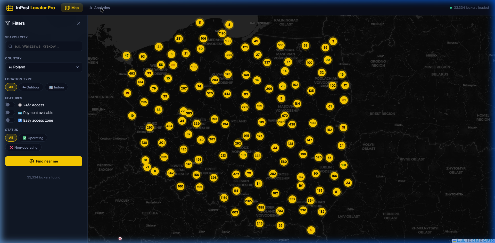
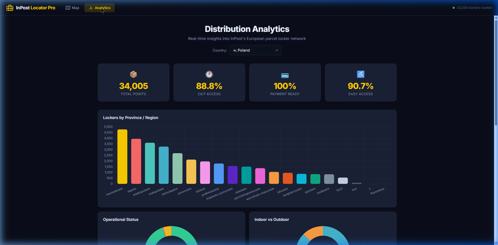
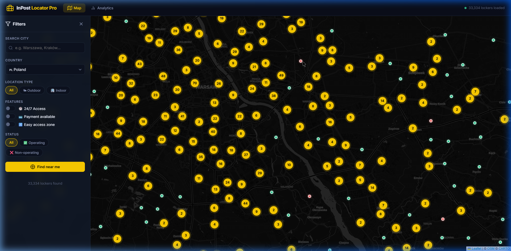

# 📦 InPost Locator Pro

> **Smart finder & distribution analytics** for InPost's European parcel locker network.  
> Built with **FastAPI** + **Leaflet.js** + **Chart.js** — a full-stack web application that turns 34,000+ Polish locker data points into an interactive, filterable map and a real-time analytics dashboard.



---

## 🎯 What is this?

InPost Locator Pro solves a real problem I've personally experienced: **finding the right parcel locker**.

Not just the *nearest* one — the one that's actually **24/7 accessible**, has **available compartments** for my parcel size, supports **on-site payment**, and is **wheelchair accessible** when I'm picking up a package for my grandmother.

The InPost app shows you lockers on a map. But it doesn't let you **filter and compare** them across multiple criteria simultaneously. This tool does.

On top of that, I added a **distribution analytics dashboard** — because once you have 34,000 data points, it's a shame not to visualize the patterns.

---

## ✨ Features

### 🗺️ Smart Finder (Map View)
- **Interactive clustered map** — 34,000+ markers rendered efficiently with Leaflet.js marker clustering
- **Multi-criteria filtering** — filter by 24/7 access, payment availability, easy access zone, indoor/outdoor, operational status
- **City search with autocomplete** — type a city name, fly to it instantly
- **Geolocation** — "Find near me" button using browser GPS
- **Detail panel** — click any locker to see its full details: address, photo, opening hours, locker size availability (A/B/C), supported functions
- **Country switching** — view Poland, Italy, Spain, or all of Europe

### 📊 Distribution Analytics Dashboard
- **KPI cards** — total lockers, 24/7 access %, payment availability %, easy access %
- **Province breakdown** — bar chart showing locker density per voivodeship
- **Top 20 cities** — horizontal bar chart of cities with the most lockers
- **Operational status** — doughnut chart (operating vs non-operating)
- **Indoor vs Outdoor** — doughnut chart of location types
- **Country breakdown** — when viewing all countries



---

## 🏗️ Architecture

```
┌─────────────────────────────────────────────┐
│  Frontend (Vanilla JS)                      │
│  ├── Leaflet.js + MarkerCluster (map)       │
│  ├── Chart.js (analytics)                   │
│  └── Modular JS (api, map, filters, app)    │
└──────────────────┬──────────────────────────┘
                   │ fetch() → JSON
┌──────────────────▼──────────────────────────┐
│  Backend (Python / FastAPI)                 │
│  ├── /api/points — filtered, cached proxy   │
│  ├── /api/points/nearby — proximity search  │
│  ├── /api/analytics — aggregated stats      │
│  ├── /api/cities — autocomplete endpoint    │
│  └── In-memory cache (10 min TTL)           │
└──────────────────┬──────────────────────────┘
                   │ httpx (async)
┌──────────────────▼──────────────────────────┐
│  InPost Points API                          │
│  api-global-points.easypack24.net/v1/points │
└─────────────────────────────────────────────┘
```

### Key Design Decisions

| Decision | Rationale |
|----------|-----------|
| **FastAPI** over Flask | Async-native, built-in OpenAPI docs, Pydantic validation, modern Python |
| **Backend proxy** instead of direct API calls from frontend | CORS avoidance, caching (API is slow for 34k points), data aggregation server-side, smaller payloads to client |
| **In-memory cache with TTL** | Simple, no external dependency (Redis would be overkill for a single-instance app). 10-min TTL balances freshness vs API load |
| **Parallel pagination with semaphore** | The InPost API paginates at 1000/page max. Fetching 35 pages sequentially would take ~30s. Parallel fetch with 10 concurrent requests brings it to ~3s |
| **Field selection** via `fields` query param | Reduces payload from InPost API by ~60%. We only fetch the 16 fields we need, not all 50+ |
| **Leaflet + MarkerCluster** over Google Maps | Free, open-source, no API key needed. MarkerCluster handles 34k markers without performance issues |
| **Vanilla JS** instead of React/Vue | Zero build step for frontend. The app is small enough that a framework adds complexity without proportional benefit |
| **Chart.js** over D3/Plotly | Lightweight (70kB), beautiful defaults, perfect for dashboard charts. D3 would be overkill |

---

## 🛠️ Tech Stack

| Layer | Technology | Version |
|-------|-----------|---------|
| Backend | Python | 3.10+ |
| Framework | FastAPI | 0.115 |
| HTTP Client | httpx | 0.28 |
| ASGI Server | Uvicorn | 0.34 |
| Map | Leaflet.js | 1.9.4 |
| Clustering | Leaflet.MarkerCluster | 1.5.3 |
| Charts | Chart.js | 4.4.7 |
| Typography | Inter (Google Fonts) | — |
| Map Tiles | CARTO Dark | — |
| Testing | pytest | 8.3 |

---

## 🚀 How to Run

### Prerequisites
- **Python 3.10+** installed
- **Git** installed

### Setup

```bash
# Clone the repository
git clone https://github.com/SzymonTyburczy/InPostIdea.git
cd InPostIdea

# Create virtual environment
python -m venv venv

# Activate it
# Windows:
.\venv\Scripts\activate
# macOS/Linux:
source venv/bin/activate

# Install dependencies
pip install -r requirements.txt

# Run the application
python run.py
```

The app starts at **http://localhost:8000**.

> **⏳ First load takes ~5-10 seconds** — the backend fetches ~34,000 points from the InPost API using parallel pagination. Subsequent requests are served from cache (10-min TTL).

### Run Tests

```bash
python -m pytest tests/ -v
```

All 13 tests should pass:
```
tests/test_analytics.py::test_compute_analytics_total PASSED
tests/test_analytics.py::test_compute_analytics_countries PASSED
tests/test_analytics.py::test_compute_analytics_statuses PASSED
tests/test_analytics.py::test_compute_analytics_247 PASSED
tests/test_analytics.py::test_compute_analytics_location_types PASSED
tests/test_analytics.py::test_compute_analytics_empty PASSED
tests/test_analytics.py::test_compute_analytics_provinces PASSED
tests/test_analytics.py::test_compute_analytics_top_cities PASSED
tests/test_cache.py::test_cache_set_and_get PASSED
tests/test_cache.py::test_cache_miss PASSED
tests/test_cache.py::test_cache_expiry PASSED
tests/test_cache.py::test_cache_invalidate PASSED
tests/test_cache.py::test_cache_clear PASSED
============================= 13 passed ==============================
```

### API Documentation

FastAPI auto-generates OpenAPI docs. With the server running, visit:
- **Swagger UI**: http://localhost:8000/docs
- **ReDoc**: http://localhost:8000/redoc

---

## 📁 Project Structure

```
InPostIdea/
├── app/
│   ├── __init__.py
│   ├── main.py            # FastAPI app — routes, static files, startup
│   ├── api_client.py      # Async InPost API client with parallel pagination
│   ├── cache.py           # In-memory TTL cache
│   └── analytics.py       # Data aggregation engine
├── static/
│   ├── css/
│   │   └── style.css      # Full design system — dark theme, responsive
│   └── js/
│       ├── api.js          # Frontend API client
│       ├── map.js          # Leaflet map + clustering + detail panel
│       ├── filters.js      # Sidebar filters + city search + geolocation
│       ├── analytics.js    # Chart.js dashboard
│       └── app.js          # App orchestrator — wires everything together
├── templates/
│   └── index.html          # Single-page HTML with both views
├── tests/
│   ├── test_cache.py       # 5 unit tests for cache module
│   └── test_analytics.py   # 8 unit tests for analytics engine
├── screenshots/            # Screenshots for README
├── requirements.txt        # Python dependencies (pinned versions)
├── run.py                  # Uvicorn entry point with hot-reload
├── .gitignore
└── README.md
```

---

## 📸 Screenshots

### Map View — Poland Overview
33,334 lockers clustered on a dark-themed interactive map with filter sidebar.


### Map View — Warsaw Zoomed
Individual lockers become visible as you zoom in. Green dots = operating, red = non-operating.



### Analytics Dashboard
KPI cards, province bar chart, top cities, status/location type doughnuts.


---

## 🧠 Assumptions & Trade-offs

1. **Poland-first approach**: The app defaults to Poland (where InPost has the densest network — 34k points). Other countries are available but have far fewer lockers.

2. **Client-side limit of 50,000 points**: To keep browser performance reasonable, the frontend loads max 50k points at a time. The API returns all points for a country, and filters are applied server-side before sending.

3. **No database**: Data is fetched live from the InPost API and cached in memory. For a production service I'd add Redis + PostgreSQL, but for this scope it's unnecessary complexity.

4. **No authentication**: This is a read-only tool — no user accounts needed.

5. **Locker availability data is mostly `NO_DATA`**: The InPost API returns availability status, but for most lockers it's `NO_DATA`. The detail panel shows it regardless, as it works for some lockers.

---

## 🔮 What I'd Add With More Time

- **Heatmap layer** — density visualization instead of markers
- **Route planning** — "show me lockers on my daily commute"
- **Comparison mode** — select 2-3 lockers and compare features side by side
- **Availability alerts** — notify when a frequently-full locker has space
- **Docker containerization** — `docker-compose up` for one-command startup
- **CI/CD pipeline** — GitHub Actions for tests + linting
- **Persistent cache** — Redis for multi-instance deployments

---

## 👤 Author

**Szymon Tyburczy**

---

## 📄 License

MIT
